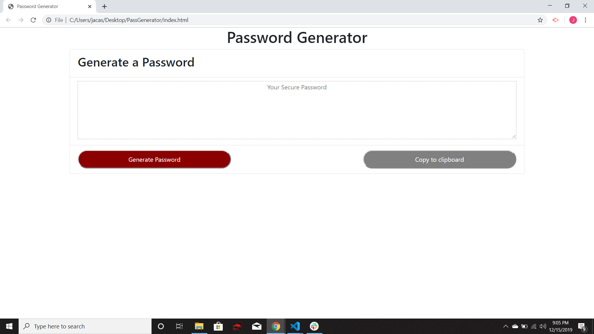

# PassGenerator
Assignment #3 password generator

## Description
* in this assignment we had to use fuctions and multiple arrays to randomize passwords.
* Using javascript I created multiple arrays and an empty array which would be filled with the users choises.
* I created a prompt followed by 4 confirms which would determine how long and which type of characters would be used in the password.
* In order to make sure a certain ammount of characters was selected, I made an if statements which would redirect the user to the begining of the prompt.
* I made the same when forming the empty array to be filled with the selected arrays.
* This generator is meant to be based on the users input and hopefully that is how it works.

## Challenges
* The biggest challenge was making sure that the functions would work properly in the live webpage.
* The function which would randomize the array of the selected arrays would always bring up an error which would say out-of-memory crash
* I moved everything around and would even change the functions around and nothing would work.

## Images
* this is how the generator looks
  

## Sources
* I created three different sheets for this password generator
* I created an Html sheet which contained bootstrap.
* I also added a style.css sheet which chaged color and borders of the buttons.
* The most important was the js sheet which had all the functionality of the page in it.

## final notes
* Not knowing why I was getting an out-of-memory crash every time the randomizer function would work.
* I hope to have been able to fully fix the problem contained in that one function.